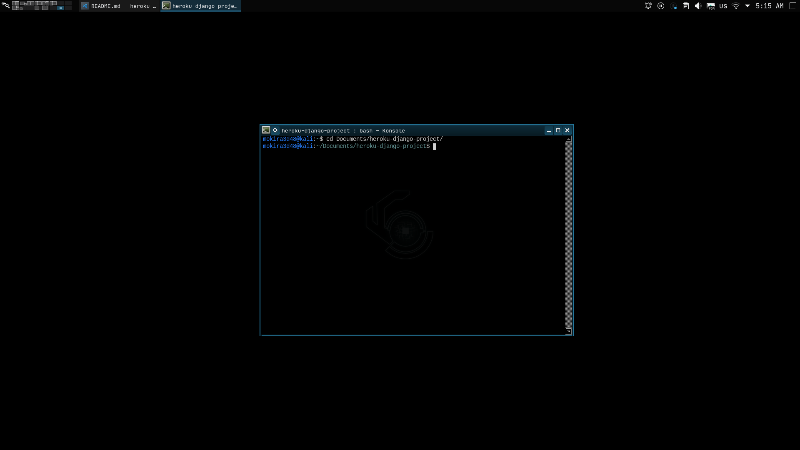

# Heroku Django Project (HDP)

<br/>


## Téléchargement du dépôt
```sh
git clone https://github.com/CodiTheck/heroku-django.git
```
Fais en bonne usage !

<br/>

## Installation et configuration

### Installation de python3
```sh
sudo apt install python3
sudo apt install python3-pip
```
Il faut s'assurer de la version de python qui est installée. La version de python
utilisée est `python 3.9.12`. Tu peux aussi utiliser la version `3.8`.


### Installation de venv
```sh
sudo apt install python3-venv
```
OU
```sh
sudo pip3 install virtualenv
```

### Créer un environnement virtuel
```sh
python3 -m venv env
```
OU
```sh
virtualenv env -p python3
```

### Démarrage de l'environnement
```sh
source env/bin/activate
```

### Installation des dépendances
```sh
pip install -r requirements.txt
```
<br/>

### Création de la base de données
La création de la base de données se fera en deux parties :

#### Première partie
Le système de gestion de base de données utilisé est `PostgreSQL`. Pour l'installer, tape la commande suivante :
```sh
sudo apt install postgresql
```

Démarre ensuite le service du SGBDR avec la commande suivante:
```sh
sudo service postgresql start
```
Connecte toi en mode `root` avec les deux commandes suivantes :
```sh
sudo su - postgres
```
```sh
psql
```

#### Seconde partie
Exécutez les trois commandes SQL suivantes :
1. Création d'un utilisateur :
```sql
CREATE USER user_name WITH ENCRYPTED PASSWORD 'secretpassword' LOGIN NOCREATEDB;
```

2. Création de la base de données pour l'utilisateur précédement créé :
```sql
CREATE DATABASE db_name OWNER user_name;
```

3. Attribution du droit de connexion à la base de données à l'utilisateur :
```sql
GRANT CONNECT ON DATABASE db_name TO user_name;
```

4. Note bien les information que tu as utilisées pour créer l'utilisateur et la base de données quelque part,
car tu en aura besoin pour configurer ton programme. Dans le cas présent, on a :
- Nom de la base de données [DB_NAME] : db_name
- Non de l'utilisateur [USERNAME] : user_name
- Mot de passe [PASSWORD] : secretpassword

5. Déconnectez vous enfin du SGBDR en faisant deux fois `CTRL + D`.

### Création des connexions du serveur WEB à la base de données
1. Il faut créer un fichier `.env` à la racine du dossier du projet à partir de l'exemple `.env_example` :
```sh
cp .env_example .env
```

2. Insérer les informations que tu avais noté à l'étape `4` de la `seconde partie` de la procédure de `Création de la base de données` dans le fichier `.env` :
```
DB_NAME=db_name
USERNAME=user_name
PASSWORD=secretpassword
HOST=127.0.0.1
PORT=5432
```

> Si le port `5432` ne marche pas, alors essayez avec le port `5433`.

3. Ouvre le fichier `core/settings.py` et rend toi à la ligne où c'est marqué `Database` dans les commentaires.

```python
...

# Database
# https://docs.djangoproject.com/en/3.2/ref/settings/#databases

DATABASES = {
   'default': {
       'ENGINE': 'django.db.backends.sqlite3',
       'NAME': BASE_DIR / 'db.sqlite3',
   }
}

# DATABASES = {
#     'default': {
#         'ENGINE': 'django.db.backends.postgresql_psycopg2',
#         'NAME': get_env_var("DB_NAME", ''),
#         'USER': get_env_var("USERNAME", ''),
#         'PASSWORD': get_env_var("PASSWORD", ''),
#         'HOST': get_env_var("HOST", ''),
#         'PORT': get_env_var('PORT', ''),
#     }
# };

...
```
Commente la première configuration de la base de données (DATABASES) et décommente la deuxième. Ce que tu dois avoir est donc :

```python
...

# Database
# https://docs.djangoproject.com/en/3.2/ref/settings/#databases

# DATABASES = {
#    'default': {
#        'ENGINE': 'django.db.backends.sqlite3',
#        'NAME': BASE_DIR / 'db.sqlite3',
#    }
# }

DATABASES = {
    'default': {
        'ENGINE': 'django.db.backends.postgresql_psycopg2',
        'NAME': get_env_var("DB_NAME", ''),
        'USER': get_env_var("USERNAME", ''),
        'PASSWORD': get_env_var("PASSWORD", ''),
        'HOST': get_env_var("HOST", ''),
        'PORT': get_env_var('PORT', ''),
    }
};

...
```

4. Exécute les commandes suivantes pour faire la migration
des modèles de base de données
```
./manage.py makemigrations
```
```
./manage.py migrate
```

### Création d'un super utilisateur pour l'espace admin
```
./manage.py createsuperuser
```

Tu peux juste renseigner le `username` et le `password`.

### Démarrage du serveur de django
```
./manage.py runserver
```
Résultats dans le terminal, qui indique que tout va bien est :
```
Watching for file changes with StatReloader
Performing system checks...

System check identified no issues (0 silenced).
January 21, 2022 - 07:53:49
Django version 3.2.6, using settings 'docs.settings'
Starting development server at http://127.0.0.1:8000/
Quit the server with CONTROL-C.
```

<br/>

## Nettoyage de la base de données
Cette section est facultative. Mais, il peut arriver un jour où tu aurras besoin de néttoyer toutes
les tables de la base de données. Alors, c'est simple. Pour y parvcenir, tu peux simplement supprimer
tous les schémas que tu as créé. Dans cet exemple, il n'y a qu'un seul schéma que tu vas néttoyer : `public`.
<br/>
Connecte toi en mode `root` avec les deux commandes suivantes :
```sh
sudo su - postgres
```
```sh
psql
```

Ensuite connecte toi en tent que `user_name` à `db_name` :
```sh
\c user_name db_name
```
Maintenant, tu peut supprimer le schéma :
```sql
DROP SCHEMA public CASCADE;
```
Ensuite tu le recrée avec la commande SQL suivante :
```sql
CREATE SCHEMA public;
```
Et enfin, il ne faut pas oublier de redonner les droit d'accès du schéma à l'utilisateur utilisé par
ton application pour se connecter.
```sql
GRANT ALL ON SCHEMA public TO user_name;
```
```sql
GRANT ALL ON SCHEMA public TO public;
```

## Hébergement du serveur sur Heroku
Concernant l'hébergement du serveur sur Heroku, tu dois faire les choses suivantes:
1. créer l'application sur Heroku en premier;
2. clonner ce projet dans votre répertoire de travail;
3. redéfinir l'URL HOST du serveur de l'application dans le fichier `core/prod_settings.py`;
4. sur héroku, au niveau des configurations de ton application, définir deux variables dans
les variables d'environnement : `SECRET_KEY` et `DJANGO_SETTINGS_MODULE` qui représentes respectievement
la `clé secrete` utilisée par le serveur et le fichier de `configuration globale du projet Django`;
5. connecter l'application créée sur Heroku à ton l'application;
6. Envoyer l'application par `Git` au serveur Heroku.


### Créer l'application sur Heroku
Pour créer l'application heroku pour héberger ton programme serveur, il
faut simplement te connecter sur le site de [heroku](https://heroku.com)
ou accède au dossier de ton projet via le terminal et exécuter les
commandes suivantes:



#### 1. Installer le CLI de Heroku
```sh
sudo snap install heroku --classic
```
> **NOTE** : Si tu utilise `Kali`, alors tu dois taper cette commande
> `sudo systemctl start snapd.service` avant de pouvoir installer le
> CLI de heroku par `snap`. C'est à dire avant que la commande ci-dessus
> ne marche.

#### 2. Se connecter à ton compte
Une fois l'installation terminé, tu peux maintenant te connecter à ton
compte `Heroku` via le CLI.
```sh
heroku login
```

Si le message suivant s'affiche, alors appuis sur la touche `ENTRER` de 
ton clavier pour continuer.

```
heroku: Press any key to open up the browser to login or q to exit:
```

Après avoir saisi tes identifiants dans le navigateur qui s'est ouvert,
si tout va bien, alors tu arras les deux derniers messages suivants
imprimés dans ton terminal.
```
...

Logging in... done
Logged in as monemail@email.com
```

Au cas où la commande `heroku login` t'affiche l'erreur suivante :
```
Command 'heroku' is available in '/snap/bin/heroku'
The command could not be located because '/snap/bin' is not included in the PATH environment variable.
heroku: command not found
```
Alors tape la commande suivante pour résoudre son cas :
```sh
sudo ln -s /snap/bin/heroku /bin/heroku
```
puis reéssaie la commande `heroku login`.


#### 3. Configure ton projet avec Git

Si tu avais déjà configuré ton projet avec Git ou tu avais clonner mon
dépôt comme je l'ai indiqué plus haut, alors pas besoin d'exécuter la 
commande suivante. Dans le cas contraire, tu dois exécuter la commande:
```sh
git init
```


> **NOTE** : Ceci est necessaire pour la suite.


#### 4. Créer ton application sur heroku
Si on suppose que le nom que tu veux donner à ton application est `monapplication`, alors tu exécute la commande suivante :
```sh
heroku create monapplication
```

#### 5. Créer une base de données à ton application
```sh
heroku addons:create heroku-postgresql
```

### Redéfinir l'URL HOST du serveur
Tu dois redéfinir l'URL HOST du serveur de l'application dans le fichier `core/prod_settings.py`
```python
import dj_database_url
from core.settings import *
from stdlib import get_env_var


DEBUG = False;
TEMPLATE_DEBUG = False;

# To force HTTPs communication to server
SECURE_PROXY_SSL_HEADER = ('HTTP_X_FORWARDED_PROTO', 'https');
SECURE_SSL_REDIRECT     = True;

# Heroku database configuration
DATABASES['default'].update(dj_database_url.config());

# HOST list allowed by this server
ALLOWED_HOSTS = ['heroku-dj.herokuapp.com'];

# CONFIGURATION DE WHITENOISE
# ================================================================
# WhiteNoise permet à votre application Web de servir ses
# propres fichiers statiques, ce qui en fait une unité autonome
# qui peut être déployée n'importe où sans dépendre de nginx,
# d'Amazon S3 ou de tout autre service externe. (Particulièrement
# utile sur Heroku, OpenShift et autres fournisseurs PaaS.).
MIDDLEWARE += ['whitenoise.middleware.WhiteNoiseMiddleware'];
STATICFILES_STORAGE = 'whitenoise.storage.CompressedManifestStaticFilesStorage';
```
Il s'agit de modifier cette ligne :
```python
# ...

ALLOWED_HOSTS = ['heroku-dj.herokuapp.com'];

# ...
```
en :
```python
# ...

# Si on suppose que ton application s'appelle : `monapplication`
ALLOWED_HOSTS = ['monapplication.herokuapp.com'];

# ...
```

### Définir des variables d'environnements nécessaire
Sur héroku, au niveau des configurations de ton application, définir deux variables dans
les variables d'environnement : `SECRET_KEY` et `DJANGO_SETTINGS_MODULE` qui représentes respectievement
la `clé secrete` utilisée par le serveur et le fichier de `configuration globale du projet Django`.


- SECRET_KEY : clé secrete
Tu dois renseigner une clé secrete différente de celle qui se trouve dans le fichier `core/settings.py`,
pour cela tu peux te rendre sur [ce site](https://djecrety.ir/) qui te permettra de générer une clé secrete propre à ton application
que tu vas ensuite copier et venir coller dans ce champ.

- DJANGO_SETTINGS_MODULE : fichier de configuration
Pour ceci, il suffit tous simplement de renseigner le champ avec cette valeur `core.prod_settings`.
Cette dernière représente le fichier de configuration de mise en production de ton application.
Ce sont les configurations qui se trouvent dans ce fichier qui seront utilisées par le serveur,
une fois en ligne.


### Connecter l'application créée sur Heroku à ton l'application


Il s'agit de configurer le dépôt local avec le dépôt distant du serveur SVM de Heroku. Pour ce faire,
tape juste la commande suivante: si on suppose que ton application s'appelle : `monapplication`

> **NOTE** : Cette étape n'est plus necessaire, si tu as suivis l'`étape 1 : Créer l'application sur Heroku` à la lettre. Car lorsqu'on crée une
> application heroku via le CLI dans le dossier d'un projet déjà
> configuré avec Git, alors, heroku profite pour connecter le dépôt local
> de l'application au dépôt distant de l'application qui est créée sur 
> son serveur de production.

Voici donc la commande pour connecter ton dépôt local au dépôt distant de
Heroku :
```sh
heroku git:remote -a monapplication
```

### Envoyer l'application par Git au serveur Heroku.
En supposant que tout s'est bien passé, alors tu es enfin prêt à déployer ton application en ligne !
- tu les changements précédement apportés au fichier `core/prod_settings.py` :
```sh
git add -A
```
ensuite :
```sh
git commit -m "Allowed HOST is defined and All is ready !"
```

- tu pousses le projet sur le serveur SVN de `Heroku` en faisant :
```sh
git push heroku master
```

### Création des tables de la base de données
Si l'envoie de l'application a été un succès, alors n'oublie pas de créer
les différentes tables de la base de données de ton application sur
Heroku. Pour ce faire, exécute la commande suivante :
```sh
heroku run python manage.py migrate
```

### C'est finit !
Après avoir pris le temps d'allumer un bon `Nightcore` dans ton répertoire de musique, tu peux maintenant
frimer en lançant ta superbe appli via ton lien :
[https://monapplication.herokuapp.com](https://monapplication.herokuapp.com) .

""" Euh... N'oublie pas de me donner une note avant de te barrer l'amis. """

<br/>
<br/>

